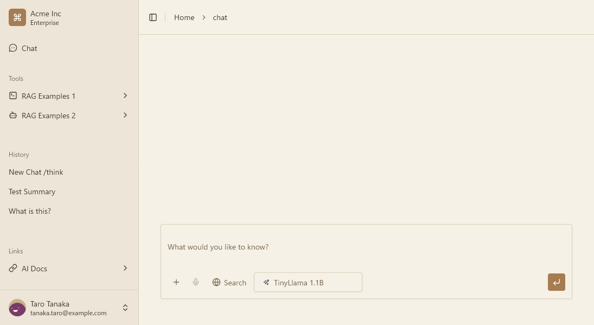

# AI-SDK x AI-Elements X Fast API Sample

A minimal full-stack chat sample with a React/Vite frontend and a FastAPI backend, showcasing streaming responses, conversation history, and file uploads.

    

## Scope

- Quick overview and local run instructions.
- Key directories and documentation links.

## Non-scope

- Detailed architecture (see docs).
- Contribution workflow details (see develop.md).

## What this repo includes

- Frontend SPA (`frontend/`) with chat UI and attachments.
- Backend API (`backend/`) with streaming chat, history, and uploads.
- Optional local persistence (`backend/.local-data/`) when enabled.

## Quick start

1. Install dependencies
   - Frontend: `pnpm install`
   - Backend: create a venv and install backend requirements
2. Run services
   - Frontend: `pnpm dev` (from `frontend/`)
   - Backend: `uvicorn app.main:app --reload` (from `backend/`)
3. Open the frontend in the browser.
4. (Optional) Update backend lock file: `pip-compile pyproject.toml -o requirements.lock` (from `backend/`)

## Docs

- Overview: `docs/README.md`
- System architecture: `docs/architecture.md`
- Frontend architecture: `docs/architecture-front.md`
- Backend architecture: `docs/architecture-back.md`
- Development workflow: `docs/develop.md`

## Key directories

- `frontend/`: React + Vite app and UI components.
- `backend/`: FastAPI app, services, and repositories.
- `docs/`: project documentation.
