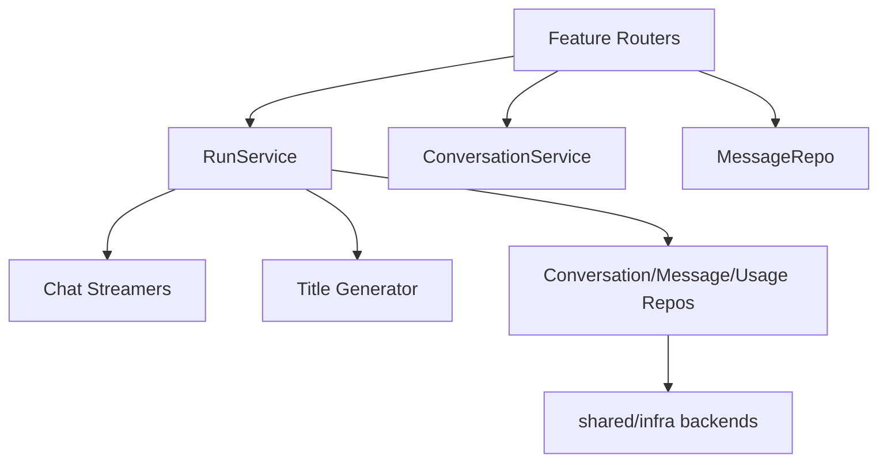
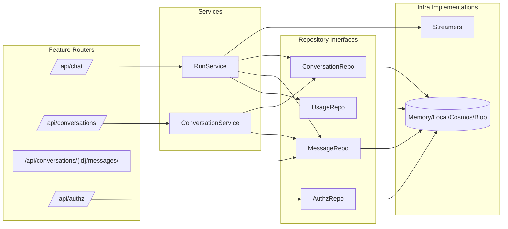
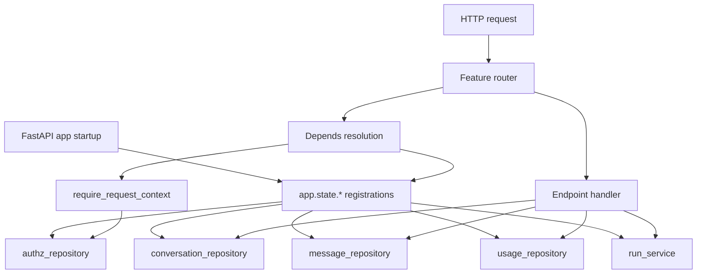
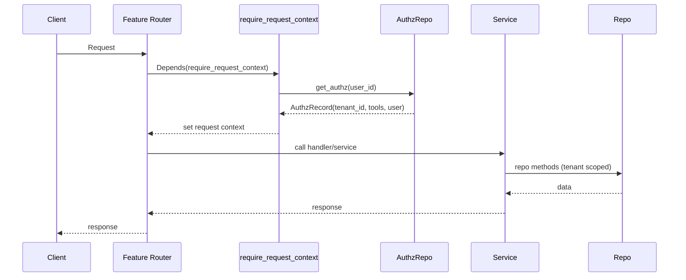

# Backend Architecture

Purpose: Describe the internal structure of the FastAPI backend, services, and storage.

## Scope

- API routes and core services.
- Storage backends and responsibilities.
- Streaming and title generation flow.

## Non-scope

- Frontend internals (see `architecture-front.md`).
- Deployment/infrastructure specifics.

## High-level structure

- FastAPI app in `backend/app`.
- Feature modules under `backend/app/features`.
- Routes live alongside features as `features/*/routes.py`.
- Repositories are interface-only under features; storage implementations live under `infra/`.
- Blob storage contracts are shared via `shared/ports`.
- Streamers for chat providers (memory, azure, ollama).

The backend separates HTTP routing, domain services, and storage backends. Feature
modules own request/response schemas and domain models, while `shared/infra` contains
backend-specific adapters (Cosmos, local, memory). The app bootstrap wires adapters
into `app.state` and endpoints depend on those interfaces.

## Module interaction map

The module map emphasizes that routers never talk to storage directly. They only
call services or repository interfaces, and concrete storage implementations live
under `infra/`.

## Core modules

- `features/run`: orchestrates chat streaming and persistence.
- `features/conversations`: list/update/archive/delete conversation metadata.
- `features/messages`: store and fetch message history.
- `features/chat/streamers`: provider-specific streaming implementation.
- `features/title`: title generation (model or fallback).
- `features/authz`: tenant/user authorization resolution and tool access.
- `features/*/routes.py`: FastAPI routers per feature.

## Storage backends

- `memory`: in-process store (non-persistent).
- `local`: JSON files under `backend/.local-data/`.
- `azure`: Cosmos DB + blob storage (when configured).

Storage implementations live in `backend/app/infra/{repository,storage}`.

## Authorization data flow

- Authz records are resolved per request via `AuthzRepository.get_authz(user_id)`.
- `CachedAuthzRepository` wraps the backing repository with LRU + TTL caching.
- Cosmos authz data is composed from two document types:
  - Tenant document (`id` = tenant UUID) with `default_tools`.
  - User document (`user_id`, `tenant_id`) with `tool_overrides` (`allow` / `deny`).
- Effective tools are computed as `default_tools + allow - deny` (deny wins).

## Blob storage contracts

- `shared/ports/blob_storage.py` defines the `BlobStorage` contract used by features.
- `infra/storage/*` implements Azure/Local/Memory backends.
- `get_object_url` returns a URL for blob access; local/memory use `/api/file/{id}/download`.

## Message/conversation models

- API payloads live in `features/*/schemas.py`, domain models in `features/*/models.py`.
- Message payloads are normalized into Pydantic models (`ChatMessage`, `MessagePart`).
- Local storage persists models as JSON; Cosmos stores per-message documents with a `message` payload.

## Tenant scoping

- Tenant resolution happens per request and is stored in request context.
- Service-layer code uses tenant-scoped adapters to avoid passing `tenant_id` into every call while keeping infra repositories request-agnostic.

## Dependency injection flow

Dependencies are resolved via `Depends(...)` and read from `app.state`. This keeps
handlers testable while allowing storage backends to be swapped at startup.

## Access control flow

Access control happens in `require_request_context`, which resolves the user identity
and authz record before any handler runs. Handlers then use tenant-scoped repositories
so tenant_id does not leak into the routing layer.

## Streaming flow

1. `/api/chat` receives a message payload.
2. `RunService` prepares conversation, persists input messages.
3. `Streamer` streams assistant response (SSE data protocol).
4. Title is generated asynchronously and persisted.
5. Usage is recorded.

### SSE data events

The stream includes typed `data-*` events for client-side orchestration:

- `data-conversation`: new conversation id for route updates.
- `data-title`: conversation title for history updates.
- `data-model`: model id used for a message (UI metadata).

These events are emitted by the streaming pipeline so the frontend can update
route state and metadata without polling.

## API responsibilities and boundaries

- Routers validate input/output and delegate to services.
- Services orchestrate streaming, persistence, and usage logging.
- Repositories abstract storage access; infra implementations handle the backend.

This keeps HTTP concerns separate from domain logic and storage concerns, making
feature-level changes (streaming, title, usage) localized to services.

## APIs served by backend

- `/api/chat` (streaming)
- `/api/conversations` (list, archive all, delete all)
- `/api/conversations/{id}` (patch, delete)
- `/api/conversations/{id}/messages`
- `/api/file` (blob upload)
- `/api/file/{id}/download` (blob download)
- `/api/capabilities`, `/api/authz`, `/health`
