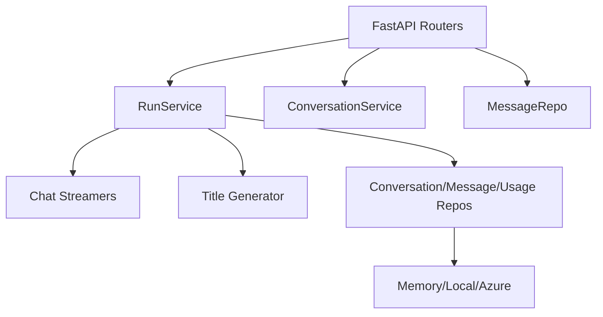
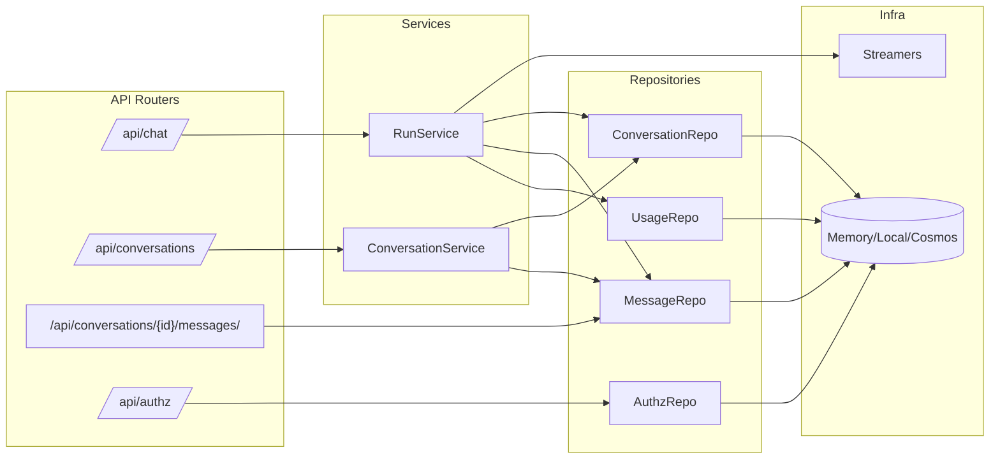
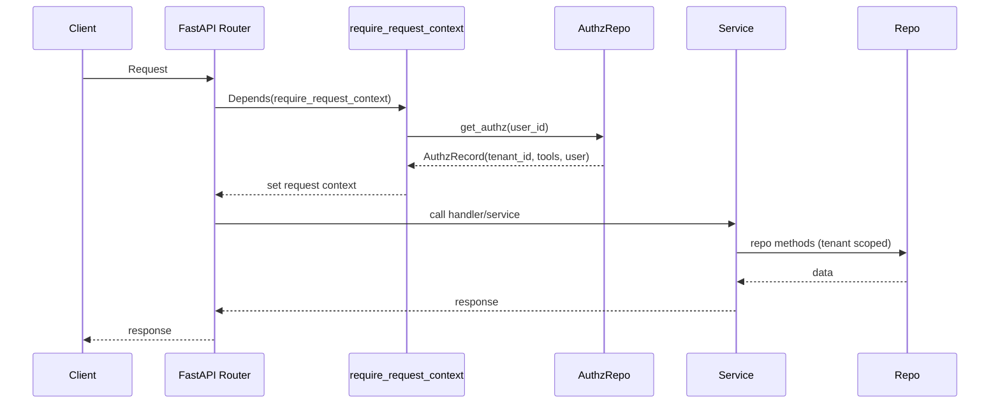

# Backend Architecture

Purpose: Describe the internal structure of the FastAPI backend, services, and storage.

## Scope

- API modules and core services.
- Storage backends and responsibilities.
- Streaming and title generation flow.

## Non-scope

- Frontend internals (see `architecture-front.md`).
- Deployment/infrastructure specifics.

## High-level structure

- FastAPI app in `backend/app`.
- Feature modules under `backend/app/features`.
- Repositories for conversation/message/usage storage.
- Streamers for chat providers (memory, azure, ollama).

## Module interaction map

## Core modules

- `features/run`: orchestrates chat streaming and persistence.
- `features/conversations`: list/update/archive/delete conversation metadata.
- `features/messages`: store and fetch message history.
- `features/chat/streamers`: provider-specific streaming implementation.
- `features/title`: title generation (model or fallback).
- `features/authz`: tenant/user authorization resolution and tool access.

## Storage backends

- `memory`: in-process store (non-persistent).
- `local`: JSON files under `backend/.local-data/`.
- `azure`: Cosmos DB + blob storage (when configured).

## Authorization data flow

- Authz records are resolved per request via `AuthzRepository.get_authz(user_id)`.
- `CachedAuthzRepository` wraps the backing repository with LRU + TTL caching.
- Cosmos authz data is composed from two document types:
  - Tenant document (`id` = tenant UUID) with `default_tools`.
  - User document (`user_id`, `tenant_id`) with `tool_overrides` (`allow` / `deny`).
- Effective tools are computed as `default_tools + allow - deny` (deny wins).

## Message/conversation models

- Message payloads are normalized into Pydantic models (`ChatMessage`, `MessagePart`).
- Local storage persists models as JSON; Cosmos stores per-message documents with a `message` payload.

## Tenant scoping

- Tenant resolution happens per request and is stored in request context.
- Service-layer code uses tenant-scoped adapters to avoid passing `tenant_id` into every call while keeping infra repositories request-agnostic.

## Dependency injection flow

## Access control flow

## Streaming flow

1. `/api/chat` receives a message payload.
2. `RunService` prepares conversation, persists input messages.
3. `Streamer` streams assistant response (SSE data protocol).
4. Title is generated asynchronously and persisted.
5. Usage is recorded.

## APIs served by backend

- `/api/chat` (streaming)
- `/api/conversations` (list, archive all, delete all)
- `/api/conversations/{id}` (patch, delete)
- `/api/conversations/{id}/messages`
- `/api/file` (blob upload)
- `/api/capabilities`, `/api/authz`, `/health`
