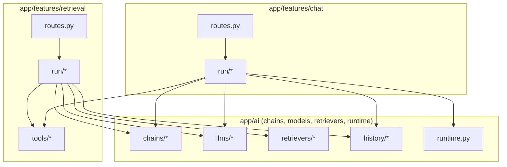
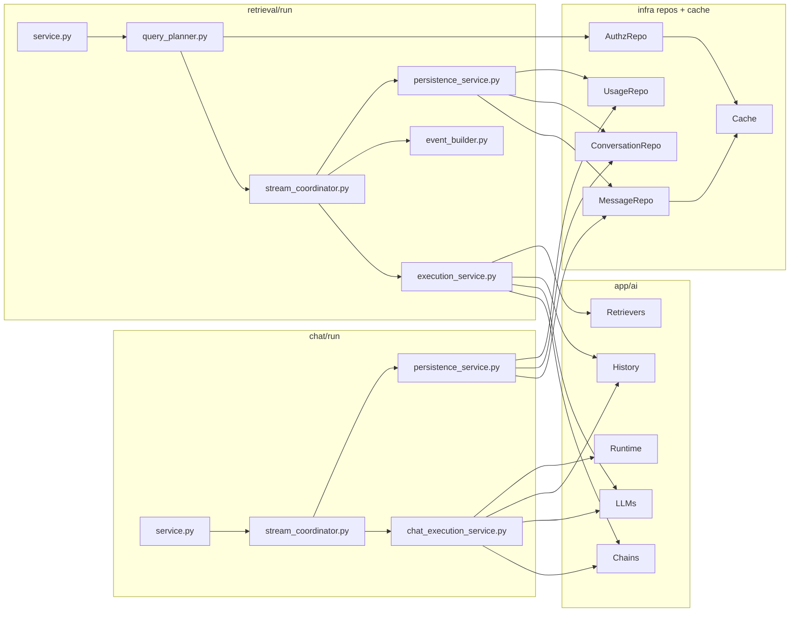
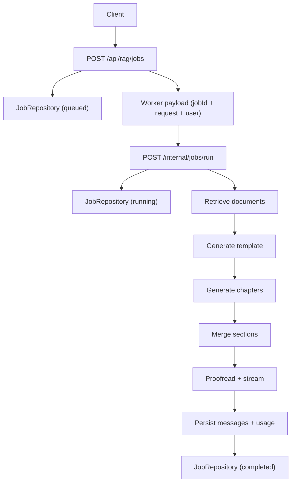
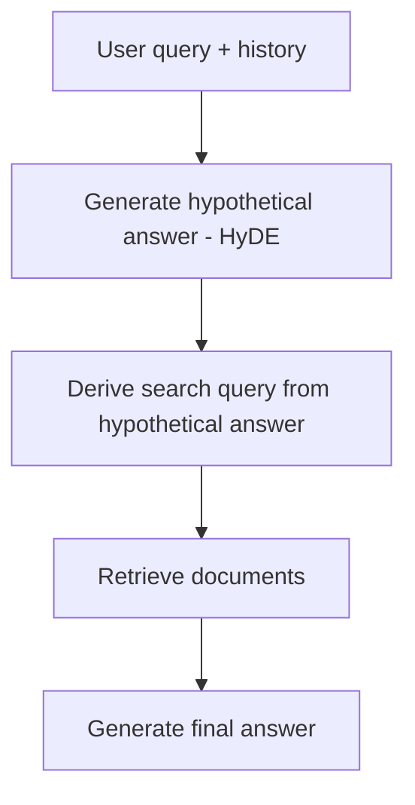

# Backend Architecture

Purpose: Describe the internal structure of the FastAPI backend, services, and storage.

## Scope

- API routes and core services.
- Storage backends and responsibilities.
- Streaming and title generation flow.

## Non-scope

- Frontend internals (see `architecture-front.md`).
- Deployment/infrastructure specifics.

## High-level structure

- FastAPI entrypoint in `backend/app/main.py`, with app factory and lifespan in
  `backend/app/core/application.py`.
- `app/core`: app bootstrap, config, middleware, telemetry, dependencies.
- `app/features`: feature modules; each has `routes.py`, `schemas.py`, `models.py`, `ports.py`, optional `service.py`.
- `app/ai`: LangChain chains, LLM/embeddings factories, retrievers, chat history.
- `app/infra`: storage clients, repositories, cache providers, blob storage, usage buffer.
- `app/shared`: cross-cutting constants, exceptions, ports (e.g., `BlobStorage`).

The backend separates HTTP routing, domain services, and storage backends. Feature
modules own request/response schemas and domain models, while `infra/` contains
backend-specific adapters (Cosmos, Firestore, local, memory). The app bootstrap wires
adapters into `app.state` (config, capabilities, repositories, caches, blob storage,
runtime services) and endpoints depend on those interfaces via `Depends(...)`.

## Module interaction map

The module map emphasizes that routers never talk to storage directly. They only
call services or repository interfaces, and concrete storage implementations live
under `infra/`.

## Feature dependency map (ai / chat / retrieval)

Notes:

- `app/ai` is lower-level; feature modules consume it but do not mutate it.
- Retrieval tools are shared between `chat` (tool-assisted chat) and `retrieval` (RAG).

## Run/Chat/Retrieval dependency detail

## Core modules

- `features/run`: orchestrates chat streaming and persistence.
- `features/conversations`: list/update/archive/delete conversation metadata.
- `features/messages`: store and fetch message history.
- `features/run/streamers`: AI SDK streaming adapters (memory or LangChain).
- `features/title`: title generation helpers.
- `features/authz`: tenant/user authorization resolution and tool access.
- `features/retrieval`: RAG query orchestration and streaming.
- `features/file`: blob upload/download endpoints.
- `features/capabilities`, `features/health`: support endpoints.
- `features/*/routes.py`: FastAPI routers per feature.

## Model resolution rules

- Selection order: request `model_id` (if provided) → `app_config.chat_default_model` → if only one
  model exists in `ChatCapabilities.providers`, use it; otherwise raise an error.
- `resolve_chat_model` validates that the selected model exists in capabilities and returns
  provider + model_id. Unknown models raise an error.
- Chat runtime resolution caches per-model runtime and falls back to the base runtime when a
  requested model is unavailable (with a warning).
- Provider constraints:
  - `azure`: `model_id` must map to `app_config.azure_openai_deployments`.
  - `gcp`: `langchain-google-genai` must be installed and `google_api_key` provided.
  - `fake`: uses local fake model with optional `chat_fake_stream_delay_ms`.

## Storage backends

- `memory`: in-process store (non-persistent).
- `local`: JSON files under `backend/.local-data/`.
- `azure`: Cosmos DB + Azure Blob (when configured).
- `gcp`: Firestore + GCS (when configured).

Storage implementations live in `backend/app/infra/{repository,storage}`.
Cache providers are selected via `app_config.cache_backend` (`memory`, `redis`, `off`)
and wrap authz/messages repositories.
Usage logs are buffered via `infra/storage/usage_buffer.py` with `off | local | azure | gcp`
backends.

## Cache strategy

- Authz cache (`CachedAuthzRepository`):
  - Keys: `authz:user:{id}`, `authz:tenant:{id}`, `authz:identity:{id}`.
  - TTL: `authz_cache_ttl_seconds` from `app/core/config.py`.
  - Cache disabled when `cache_backend=off`.
  - Cache invalidated on save; list queries are not cached.
- Messages cache (`CachedMessageRepository`):
  - Keys: `messages:{tenant}:{user}:{conversation}`.
  - TTL: `messages_cache_ttl_seconds` from `app/core/config.py`.
  - Cache is only populated for full conversation reads (`limit=None`, no storage continuation).
  - Cache bypasses:
    - partial lists with `limit` set,
    - continuation tokens from storage (non-cache tokens).
  - Cache is updated on upsert and invalidated on delete.

## Authorization data flow

- `AuthzContextMiddleware` resolves authz context for most `/api/*` routes.
- `request_context.resolve_request_context` uses `AuthzService.resolve_access` to:
  - look up `UserIdentity` → `User` → `Tenant`, or
  - provision a new user from a `ProvisioningRecord` if eligible.
- `CachedAuthzRepository` wraps the backing repository with TTL caching.
- Effective tools are computed by merging tenant defaults with user overrides.

## Tool authorization rules (chat + retrieval)

- Tool scope is tenant/user scoped via request context (`tenant_id`, `user_id`).
- Allowed tools are computed by `merge_tools(default_tools, tool_overrides)`:
  - apply user allow list on top of tenant defaults,
  - remove any deny-listed tools,
  - de-duplicate by insertion order.
- Authorization checks accept exact tool id or prefix match (tool id as namespace).
- Retrieval:
  - `QueryPlanner.resolve_tool_context` validates access and requires a provider.
  - Unauthorized access returns HTTP 403.
- Chat tool-assisted retrieval:
  - `chat/run/retrieval_context.build_retrieval_context` validates access.
  - Unauthorized access raises `RunServiceError` which is streamed as an error event.

## Blob storage contracts

- `shared/ports/blob_storage.py` defines the `BlobStorage` contract used by features.
- `infra/storage/*` implements Azure/Local/Memory backends.
- `get_object_url` returns a URL for blob access; local/memory use `/api/file/{id}/download`.

## Message/conversation models

- API payloads live in `features/*/schemas.py`, domain models in `features/*/models.py`.
- Message payloads are normalized into Pydantic models (`ChatMessage`, `MessagePart`).
- Local storage persists models as JSON; Cosmos stores per-message documents with a `message` payload.

## Tenant scoping

- Tenant resolution happens per request and is stored in request context.
- Service-layer code uses tenant-scoped adapters to keep infra repositories request-agnostic.

## Memory and history usage

- Memory policy is defined in `app/ai/models.py` (`MemoryPolicy.window_size` default 16).
- `build_history_factory` constructs a `RepositoryChatMessageHistory` with:
  - `limit=window_size` and `descending=True` for windowed loads,
  - results reversed to chronological order before passing to LangChain.
- History is injected via `MessagesPlaceholder("history")`:
  - chat chains: system message → history → latest user input,
  - retrieval answer chains: system message → history → user question + sources.
- Streaming runs set `write_enabled=False` for LangChain history; persistence happens in
  `persistence_service.py` after streaming completes.

## Dependency injection flow

Dependencies are resolved via `Depends(...)` and read from `app.state`. This keeps
handlers testable while allowing storage backends to be swapped at startup.

## Access control flow

Access control happens in `AuthzContextMiddleware`, which resolves the user identity
and authz record before any handler runs. Handlers then use tenant-scoped repositories
so tenant_id does not leak into the routing layer.

## Streaming flow

1. `/api/chat` receives a message payload.
2. `RunService` prepares conversation, persists input messages.
3. `ChatRuntime` streams assistant response (optionally with retrieval system prompt).
4. `Streamer` emits AI SDK events (`start`, `text-start`, `text-delta`, `text-end`).
5. Title is generated asynchronously and emitted via `data.title`.
6. Usage is recorded.

### SSE data events

The stream includes typed `data-*` events for client-side orchestration:

- `data-conversation`: conversation id for route updates.
- `data-title`: conversation title for history updates.
- `data-model`: model id used for a message (UI metadata).

When `tool_id` is present, the stream also emits `reasoning-*` events with retrieval
tool/query metadata.

These events are emitted by the streaming pipeline so the frontend can update
route state and metadata without polling.

## LangChain chat + RAG flow (request to stream)

This flow describes how LangChain is used to build prompts, retrieval context, and
streamed responses for chat and RAG endpoints.

Notes:

- Chat uses LangChain message history + prompt template.
- RAG adds a system prompt built from retrieved documents, and emits RAG-specific
  data events (`data.rag`, `data.sources`, `data.cot`).

## LangChain conversation, persistence, and memory flow

This flow highlights how stored messages are reused as memory and persisted
throughout a LangChain-backed chat run.

Notes:

- Message history is fetched from the repository and provided to LangChain as
  conversation memory.
- The assistant response is persisted as message parts after the stream completes.
- Titles and usage are persisted alongside the message update.

## Retrieval (RAG) flow

1. `/api/rag/query` receives tool/provider parameters and chat history.
2. Tool specs are loaded at startup from `retrieval_tools.yaml`.
3. Request context validates tenant/tool access and resolves provider/data source.
4. Retriever is built via `ai/retrievers/factory.py` (`memory`, `local-files`, `ai-search`,
   `vertex-search`, `vertex-answer`).
5. Results are streamed with AI SDK events (`start`, `data.conversation`, `data.cot`,
   `data.rag`, `data.sources`, `source-url`, `text-*`, `data.title`).
6. Usage is recorded; conversations are upserted and titled as needed.

### Retrieval mode behavior

- `simple`: search_query = user_query, question = user_query.
- `chat`: if `tool.query_prompt` exists, generate search_query from history + last user message.
- `answer`: force provider `vertex-answer`; answer text comes from answer documents (no LLM).

Notes:

- `query_prompt` only affects search_query generation; it does not replace the answer question.
- `answer` mode bypasses LLM generation and returns answer docs directly.

## Longform RAG pipeline

Longform runs as an asynchronous job so the UI can close while the backend continues.
The API creates a job record, returns a worker payload, and the worker executes the
pipeline with `pipeline="longform"`.

### Entry points

- API job creation: `POST /api/rag/jobs`
- Worker execution: `POST /internal/jobs/run` (internal-only)

### Pipeline steps

1. Retrieval: fetch documents for the query.
2. Template generation: produce an outline/skeleton using `templatePrompt`.
3. Chapter generation: generate each section using `chapterPrompt`.
4. Merge: combine chapter drafts using `mergePrompt`.
5. Proofread: refine the merged draft using `proofreadPrompt` (streamed output).

Prompt sources:

- Defaults come from `retrieval_tools.yaml`.
- Request fields (`templatePrompt`, `chapterPrompt`, `mergePrompt`, `proofreadPrompt`)
  override tool defaults for a single run.

Notes:

- The worker updates `job_id -> conversation_id` once the conversation is created.
- `proofread` is the streamed step; earlier steps are internal LLM calls.

### HyDE flow

HyDE (Hypothetical Document Embeddings) inserts a "hypothetical answer" generation
step before retrieval to improve search relevance. It is toggled by `hydeEnabled`
in the retrieval request payload.

Behavior:

- HyDE is optional (toggle) and does not change event order or payload shape.
- When disabled, the flow remains identical to `simple` / `chat` mode behavior.

### HyDE / query_prompt / answer comparison

| Scenario | Search query source | LLM for query | LLM for answer | Provider behavior |
| --- | --- | --- | --- | --- |
| `simple` | user query | no | yes | provider from tool |
| `chat` + `query_prompt` | generated from history + last user message | yes | yes | provider from tool |
| HyDE enabled | hypothetical answer from history + last user message | yes | yes | provider from tool (unless `answer`) |
| `answer` | user query (HyDE disabled) | no | no | provider forced to `vertex-answer` |

Notes:

- HyDE takes precedence over `query_prompt` when `hydeEnabled=true` and mode is not `answer`.
- `query_prompt` only affects `search_query`, not the final answer question.

## API responsibilities and boundaries

- Routers validate input/output and delegate to services.
- Services orchestrate streaming, persistence, and usage logging.
- Repositories abstract storage access; infra implementations handle the backend.

This keeps HTTP concerns separate from domain logic and storage concerns, making
feature-level changes (streaming, title, usage) localized to services.

## APIs served by backend

- `/api/chat` (streaming)
- `/api/rag/query` (streaming retrieval)
- `/api/conversations` (list, archive all, delete all)
- `/api/conversations/{id}` (patch, delete)
- `/api/conversations/{id}/messages` (list)
- `/api/conversations/{id}/messages/{message_id}` (reaction)
- `/api/file` (upload)
- `/api/file/{id}/download` (download)
- `/api/capabilities`, `/api/authz`, `/health`

## Tests

- `backend/tests/unit`: unit tests for services and helpers.
- `backend/tests/integration`: integration tests against storage adapters.
- `backend/tests/contract`: API contract/response shape tests.
