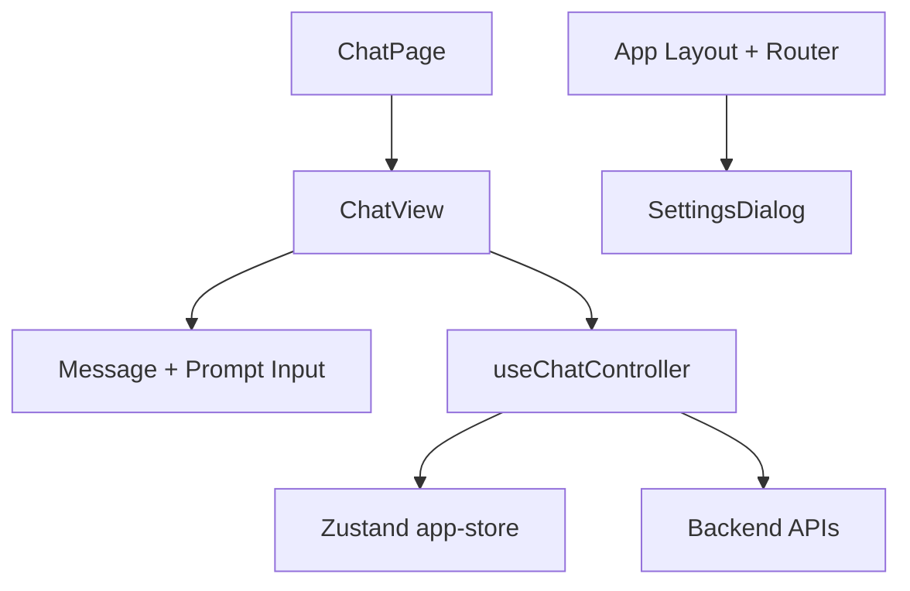

# Frontend Architecture

Purpose: Describe the internal structure of the frontend UI, state, and data flow.

## Scope

- UI composition and core modules.
- Client-side state and data fetching patterns.
- Chat rendering and attachment flow.

## Non-scope

- Backend internals (see `architecture-back.md`).
- Infrastructure deployment details.

## High-level structure

- React + Vite SPA in `frontend/`.
- Routing via `react-router`.
- Shared UI primitives in `frontend/src/components/ui`.
- Feature-level UI in `frontend/src/components/app`.

## State management

- `useChatController` orchestrates:
  - routing-derived conversation id
  - chat streaming state (via `@ai-sdk/react`)
  - message fetching and updates
  - history updates in the sidebar
- `useAppStore` (Zustand) holds:
  - history list and fetch/update helpers
  - authz state
  - theme/palette preferences

## Chat UI flow

- `ChatPage` renders `ChatView`.
- `ChatView` renders:
  - conversation messages
  - prompt input with attachments
  - streaming status and actions
- `PromptInput` manages local file selection and previews.
- Attachments are uploaded to `/api/file` before send.

## APIs called by frontend

- `/api/chat` for streaming responses.
- `/api/conversations` and `/api/conversations/{id}/messages`.
- `/api/file` for uploads.
- `/api/capabilities` for model list.
- `/api/authz` for authorization metadata.

