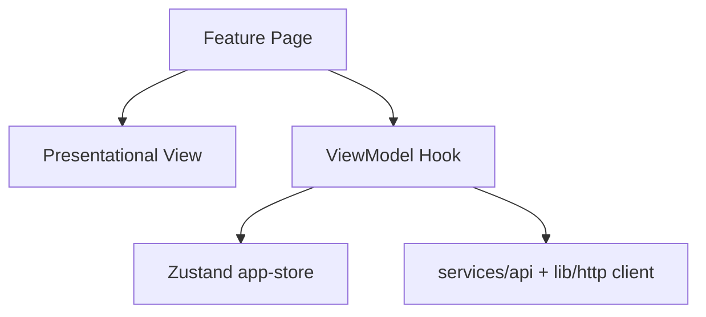
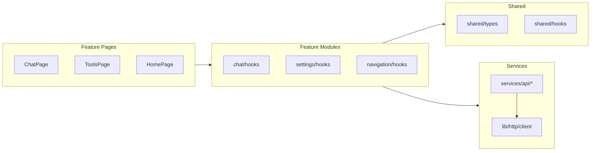
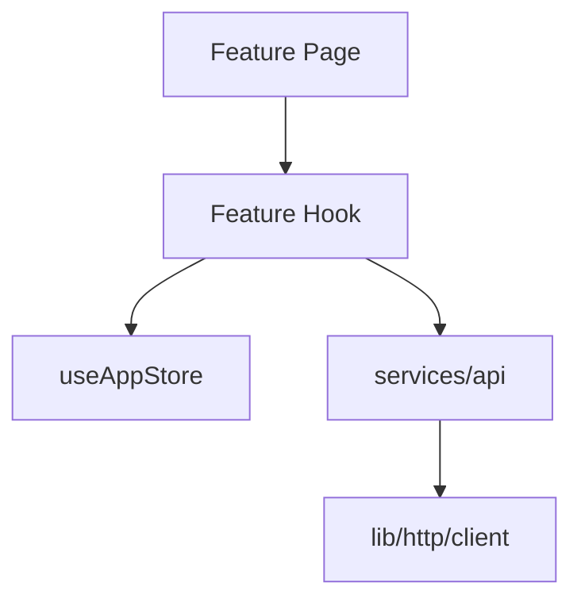
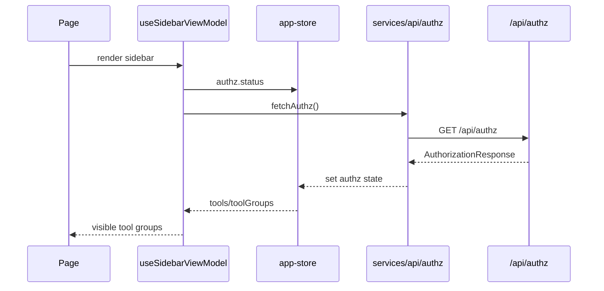

# Frontend Architecture

Purpose: Describe the internal structure of the frontend UI, state, and data flow.

## Scope

- UI composition and core modules.
- Client-side state and data fetching patterns.
- Chat rendering and attachment flow.

## Non-scope

- Backend internals (see `architecture-back.md`).
- Infrastructure deployment details.

## High-level structure

- React + Vite SPA in `frontend/`.
- Routing via `react-router`.
- Shared UI primitives in `frontend/src/components/ui`.
- Feature modules in `frontend/src/features/*` (components/hooks/store/config/types).
- Page components under `frontend/src/features/*/pages`.
- API access is always via `services/api/*`, which delegates to `lib/http/client`.

The frontend is organized around feature folders. Each feature owns its UI, state, and
API orchestration, while shared types/hooks live under `shared/*`. Pages are thin
containers that compose feature hooks and components.

## UI design policy (MVVM-style)

This frontend follows a lightweight MVVM-style convention for readability and maintenance.

- View: Presentational components that only render props.
  - Example: `features/chat/components/chat-view.tsx`
- ViewModel: Feature hooks that own state, side effects, and handlers.
  - Example: `features/chat/hooks/use-chat-view-model.ts`
- Page: Wires ViewModel to View.
  - Example: `features/chat/pages/chat-page.tsx`

Rules:

- View components never import store/router hooks or services directly.
- Declarative router components (e.g. `Link`) are allowed in Views.
- ViewModels may access store/router/services and return a UI-ready API.
- Pages and containers only compose ViewModels and Views.
- ViewModel hooks are named `use-*-view-model.ts`.



## Module interaction map



Pages should only compose feature logic and view components; they should not
directly call `lib/http/client` or reach into other features.

## State management

- `useChatViewModel` orchestrates:
  - routing-derived conversation id
  - chat streaming state (via `@ai-sdk/react`)
  - message fetching and updates
  - history updates in the sidebar
- `useAppStore` (Zustand) holds:
  - history list and fetch/update helpers
  - authz state
  - theme/palette preferences

## Chat UI flow

- `ChatPage` renders `ChatView` (page under `features/chat/pages`).
- `ChatView` renders:
  - conversation messages
  - prompt input with attachments
  - streaming status and actions
- `PromptInput` manages local file selection and previews.
- Attachments are uploaded to `/api/file` before send.
- Attachment downloads use `/api/file/{fileId}/download`.

## Chat screen architecture (feature focus)

Directory layout and responsibilities:

- `features/chat/pages`: route-level wiring (thin containers).
- `features/chat/components`: View layer (stateless render, props only).
- `features/chat/hooks`: ViewModel + supporting hooks (state/effects/handlers).
- `features/chat/store`: local feature state (if needed).
- `features/chat/types`: domain/UI types.
- `features/chat/config`: feature config (model list, defaults).

`useChatViewModel` is the orchestrator. It composes specialized hooks and exposes
a UI-ready API for the View layer.

Split hooks and roles:

- State management
  - `use-chat-model-settings-view-model`: model selection + advanced settings state.
  - `use-chat-input-view-model`: prompt input state + submit handling.
  - `use-chat-message-list-view-model`: message list UI state (copy status).
- Side effects (routing / lifecycle / pagination)
  - `use-conversation-lifecycle`: URL-based conversation id sync + history updates.
  - `use-conversation-messages`: initial fetch + pagination + continuity refs.
  - `use-chat-route-reset`: route transitions that require state reset.
  - `use-chat-scroll-controller`: infinite scroll + scroll position preservation.
- UI operation logic
  - `use-chat-model-metadata`: attach model ids from streamed data events.
  - `use-chat-message-reactions`: optimistic like/dislike + rollback.
  - `use-chat-retry`: retry body composition + parent message resolution.

## Hook dependency and data flow

View composition:

- `ChatView` -> `useChatViewModel` -> individual hooks.

State + routing:

- `/chat` is "new chat"; `/chat/c/:id` is "existing conversation".
- `use-conversation-lifecycle` derives `activeConversationId` from URL + local id.
- `use-chat-route-reset` clears local state when explicitly returning to `/chat`.

Server-sent data events:

- `useChat` receives `data-*` events.
- `data-conversation` and `data-title` are handled by `use-conversation-lifecycle`.
- `data-model` is handled by `use-chat-model-metadata` to enrich message metadata.

```
ChatView
  -> useChatViewModel
      -> useChat (stream)
      -> use-conversation-lifecycle
      -> use-conversation-messages
      -> use-chat-route-reset
      -> use-chat-scroll-controller
      -> use-chat-model-metadata
      -> use-chat-message-reactions
      -> use-chat-retry
      -> use-chat-input-view-model
      -> use-chat-message-list-view-model
      -> use-chat-model-settings-view-model
```

## Design decisions (Why)

- Route reset runs only on `/chat` after `/chat/c/:id` to avoid message flicker
  during the brief redirect while a new conversation id is negotiated.
- Message fetch skips when the id is fresh from streaming data to avoid reordering
  or erasing optimistic messages.
- Scroll restoration uses the previous scroll height to keep the same message in
  view after prepending older items.
- Reaction updates are optimistic but revert on failure to keep UI consistent with
  backend state.
- Streamed model ids are attached lazily so the UI can render before metadata
  arrives, keeping the stream responsive.

## APIs called by frontend

- `/api/chat` for streaming responses.
- `/api/conversations` and `/api/conversations/{id}/messages`.
- `/api/file` for uploads.
- `/api/file/{fileId}/download` for downloads.
- `/api/capabilities` for model list.
- `/api/authz` for authorization metadata.

## Shared vs feature boundaries

- `shared/*`: cross-feature types/hooks/store helpers.
- `lib/http`: shared request/response utilities.
- `services/api/*`: typed API clients, feature-agnostic.

## Dependency injection flow



Dependency injection on the frontend is lightweight: feature hooks read from the store
and call typed API clients. The HTTP client is shared and never used directly by pages.

## Access control flow



Access control is enforced in the sidebar by reading `authz` state from the store.
If authz is not loaded, the sidebar triggers `fetchAuthz()` and renders loading states.
