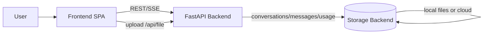

# System Architecture

Purpose: Describe the overall system structure, key data flows, and integration boundaries.

## Scope

- End-to-end components (frontend, backend, storage).
- Primary runtime flows (chat streaming, history, file upload).
- Key external interfaces.

## Non-scope

- Frontend internal component structure (see `architecture-front.md`).
- Backend internal module structure (see `architecture-back.md`).

## System overview

- Frontend SPA (React + Vite) renders the chat experience.
- Backend API (FastAPI) serves chat streaming, conversation history, and file upload/download.
- Storage backend is selectable (memory/local/azure).

## Primary flows

### Chat streaming

1. Frontend posts a chat message to `/api/chat`.
2. Backend streams assistant response via SSE (`data` protocol).
3. Backend persists messages and updates conversation metadata (title, updatedAt).

### Conversation history

- Frontend fetches conversation list from `/api/conversations`.
- Frontend fetches message history from `/api/conversations/{id}/messages`.

### File upload

- Frontend uploads to `/api/file`.
- Backend stores the blob and returns a `fileId`.
- `fileIds` are included in subsequent chat requests for association.

### File download

- Frontend requests `/api/file/{fileId}/download`.
- Backend streams blob data from the configured storage backend.

## External interfaces

- `/api/chat` (streaming)
- `/api/conversations` (list, delete all, archive all)
- `/api/conversations/{id}` (patch, delete)
- `/api/conversations/{id}/messages`
- `/api/file`
- `/api/file/{fileId}/download`
- `/api/capabilities`, `/api/authz`, `/health`

## Related docs

- Frontend internals: `docs/architecture-front.md`
- Backend internals: `docs/architecture-back.md`
